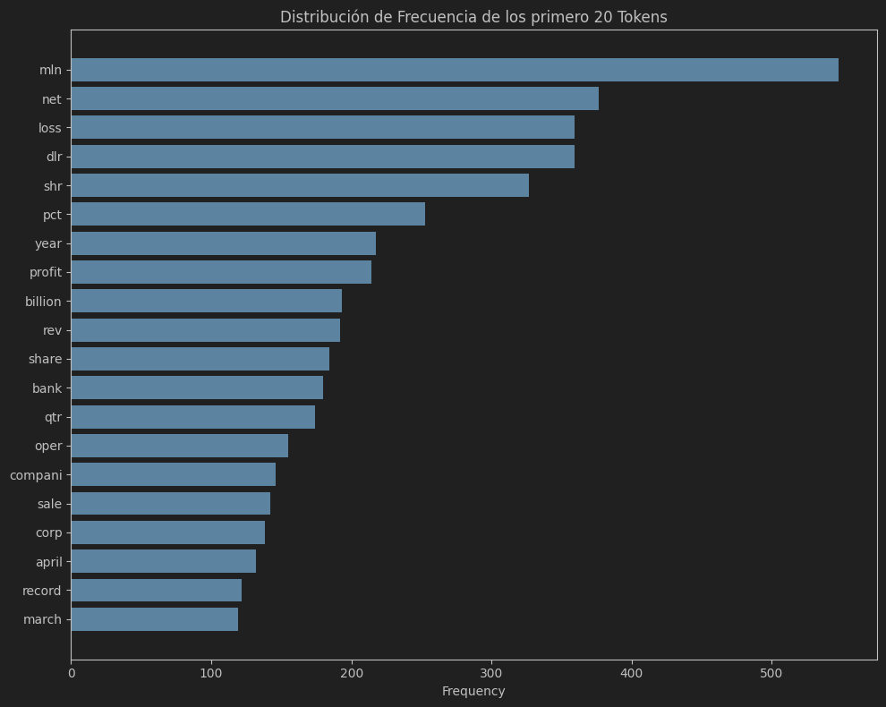

# Proyecto 1: Integración de modelos Naive Bayes y regresión logística multinomial para clasificación multiclase con evaluación

**Integrantes**:

| Apellidos y nombres | Código |
|---------------------|--------|
| Meza Rodriguez, Fiorella Ivonne | 20192730G |
| Murillo Dominguez, Paul Hans | 20193507J |


**Descripción**: Desarrolla un sistema de clasificación de texto que combine modelos generativos (Naive Bayes) y discriminativos (Regresión Logística Multinomial) para tareas de clasificación multiclase, como la categorización de noticias. Implementa técnicas de descenso de gradiente estocástico con mini-lotes y regularización para optimizar los modelos. Evalúa el rendimiento utilizando métricas como precisión, recall, medida F y realiza pruebas de significancia estadística, incluyendo la prueba bootstrap pareada.

**Resultados esperados**:
- Implementación funcional de Naive Bayes y Regresión Logística Multinomial.
- Sistema de clasificación que integra ambos modelos para mejorar la precisión.
- Optimización mediante descenso de gradiente estocástico con mini-lotes y regularización.
- Evaluación exhaustiva utilizando precisión, recall, medida F, y pruebas de significancia.
- Análisis comparativo entre modelos generativos y discriminativos.
- Documentación detallada de la implementación y los resultados.

**Entradas**:
- Conjunto de datos etiquetado para clasificación multiclase (e.g., Reuters News Dataset).
- Parámetros de optimización y regularización.
- Configuraciones para pruebas estadísticas.

**Salidas**:
- Modelos entrenados de Naive Bayes y Regresión Logística Multinomial.
- Reporte de métricas de evaluación (precisión, recall, F1) para cada modelo.
- Resultados de pruebas de significancia estadística.
- Visualizaciones de la convergencia del descenso de gradiente.
<<<<<<< Updated upstream
- Análisis interpretativo de los modelos.
=======
- Análisis interpretativo de los modelos.


7. Documentación Detallada de la Implementación y los Resultados
   La documentación completa incluye descripciones detalladas de cada paso, justificaciones de las decisiones tomadas,
   análisis de resultados y conclusiones.

**Preprocesamiento**:

- Se limpiaron y normalizaron los textos eliminando caracteres no alfabéticos, aplicando lematización, stemming y
  eliminando stopwords para reducir el ruido en los datos.

**Vectorización**:

- Se utilizó TF-IDF para representar los documentos en un espacio vectorial, lo que permite capturar la importancia
  relativa de las palabras en los documentos.

**Modelos**:

- **Naive Bayes
  **: Modelo generativo que asume independencia entre las características. Es rápido y eficiente para clasificación de
  texto.

- **Regresión Logística Multinomial (SGDClassifier)
  **: Modelo discriminativo que optimiza la probabilidad logarítmica utilizando descenso de gradiente estocástico con
  mini-lotes y regularización L2 para prevenir el sobreajuste.

- **Voting Classifier
  **: Combina los modelos anteriores mediante votación suave para mejorar la precisión y robustez del sistema.

**Evaluación**:

- Se calcularon métricas como precisión, recall, F1-score y Hamming Loss para cada modelo, proporcionando una visión
  completa del rendimiento.

**Pruebas de Significancia**:

- Se realizaron pruebas bootstrap pareadas para comparar la significancia de las diferencias en el rendimiento entre los
  modelos, asegurando que las mejoras observadas sean estadísticamente relevantes.

**Interpretación**:

- Se analizaron las características más importantes del modelo de Regresión Logística para entender qué palabras
  influyen más en las predicciones, ofreciendo insights sobre el comportamiento del modelo.
</details>


## Índice

1. [Introducción](#introducción)
2. [Descripción del Proyecto](#descripción-del-proyecto)
3. [Instalación y Configuración](#instalación-y-configuración)
4. [Uso del Sistema](#uso-del-sistema)
5. [Estructura del Código](#estructura-del-código)
6. [Decisiones Técnicas](#decisiones-técnicas)
7. [Análisis de Resultados](#análisis-de-resultados)
8. [Contribuciones Individuales](#contribuciones-individuales)
9. [Posibles Mejoras](#posibles-mejoras)
10. [Referencias](#referencias)

---

## Introducción

Este proyecto aborda la clasificación automática de textos utilizando el conjunto de datos de noticias financieras de Reuters. Se implementan y comparan varios modelos de aprendizaje automático para tareas de clasificación multiclase y multietiqueta, incluyendo Naive Bayes, Regresión Logística Multinomial y un Clasificador de Votación.

## Descripción del Proyecto

El objetivo principal es construir un sistema capaz de clasificar documentos de noticias en múltiples categorías. El proyecto tendrá la siguiente estructura:

- **Preprocesamiento de textos**: Limpieza, tokenización, lematización, stemming y eliminación de palabras vacías.
- **Representación vectorial**: Transformación de textos en vectores mediante TF-IDF.
- **Entrenamiento de modelos**: Implementación de modelos de clasificación y combinación de estos.
- **Evaluación**: Uso de métricas como precisión, recall, F1-score y Hamming Loss para evaluar el rendimiento.
- **Análisis estadístico**: Pruebas de significancia estadística para comparar modelos.
- **Visualización**: Gráficas de las características más relevantes y de la convergencia del entrenamiento.

## Instalación y Configuración

### Requisitos previos

- Python 3.7 o superior
- pip instalado
- Jupyter Notebook o JupyterLab instalado

### Instalación

1. **Clonar el repositorio**:

   ```bash
   git clone https://github.com/Overglitch/CC0C2-NLP.git
   cd PC2
   ```

2. **Crear un entorno virtual**:

   ```bash
   python -m venv venv
   source venv/bin/activate  # En Windows: venv\Scripts\activate
   ```

3. **Instalar las dependencias**:

   ```bash
   pip install -r resources/requirements.txt
   ```

## Uso del Sistema

Para ejecutar el proyecto:

1. **Activar el entorno virtual**:

   ```bash
   source venv/bin/activate
   ```

2. **Iniciar Jupyter Notebook**:

   ```bash
   jupyter notebook
   ```

3. **Abrir el notebook**:

   - Ingresa al directorio `PC2` y abre el archivo `main.ipynb`.

4. **Ejecutar las celdas del notebook**:


El sistema realizará las siguientes acciones:

- Carga y preprocesamiento del conjunto de datos Reuters.
- Entrenamiento de los modelos de clasificación.
- Evaluación y comparación de los modelos.
- Generación de visualizaciones y análisis de resultados.
- 
## Estructura del Código

- **`main.ipny`**: Archivo principal que ejecuta el flujo completo del proyecto.
- **Funciones y módulos**:

  - **Carga de datos**:
    - `load_reuters_dataset()`: Carga el conjunto de datos y separa en entrenamiento y prueba.
  - **Preprocesamiento**:
    - `encode_labels()`: Codifica las etiquetas multiclase.
    - `create_dataframes()`: Crea DataFrames para manipulación.
    - `load_stopwords()`: Carga las palabras vacías.
    - `preprocess_text()`: Limpia y normaliza los textos.
  - **Vectorización**:
    - `vectorize_text()`: Aplica TF-IDF a los textos preprocesados.
    - `plot_top_features()`: Visualiza las características más frecuentes.
  - **Modelos**:
    - `train_naive_bayes()`: Entrena el modelo Naive Bayes.
    - `train_logistic_regression()`: Entrena el modelo de Regresión Logística Multinomial.
    - `train_voting_classifier()`: Combina modelos mediante votación.
  - **Evaluación**:
    - `evaluate_model()`: Calcula métricas de rendimiento.
    - `print_performance_summary()`: Muestra un resumen comparativo.
  - **Pruebas Estadísticas**:
    - `bootstrap_paired_test()`: Realiza pruebas bootstrap pareadas.
    - `perform_bootstrap_tests()`: Ejecuta comparaciones entre modelos.
  - **Visualización e Interpretación**:
    - `plot_feature_importance()`: Muestra las características más importantes del modelo.

- **Nota**: El código contiene comentarios descriptivos que explican la funcionalidad de cada sección.

## Decisiones Técnicas

- **Preprocesamiento**:
  - Se aplicó lematización y stemming para reducir las palabras a su forma base.
  - Se eliminaron stopwords y palabras de longitud menor a 3 caracteres para reducir ruido.
- **Representación Vectorial**:
  - Se utilizó TF-IDF para capturar la importancia de las palabras en los documentos.
- **Modelos Seleccionados**:
  - **Naive Bayes**: Por su eficiencia en clasificación de texto.
  - **Regresión Logística Multinomial**: Para capturar relaciones más complejas entre características.
  - **Clasificador de Votación**: Para combinar las fortalezas de ambos modelos y mejorar el rendimiento.
- **Evaluación**:
  - Uso de métricas macro para manejar el desbalance en las clases.
- **Pruebas de Significancia**:
  - Se implementó un enfoque bootstrap para comparar los modelos.

## Análisis de Resultados

### Métricas de Rendimiento

| Modelo                | Accuracy | Hamming Loss | Precision | Recall | F1-score |
|-----------------------|----------|--------------|-----------|--------|----------|
| Naive Bayes           | 0.4468   | 0.0088       | 0.0555    | 0.0178 | 0.0222   |
| Logistic Regression   | 0.7128   | 0.0049       | 0.3888    | 0.1536 | 0.2019   |
| Voting                | 0.5664   | 0.0072       | 0.1284    | 0.0354 | 0.0466   |

### Interpretación

- **Naive Bayes** muestra un rendimiento limitado, con bajas métricas de precisión, recall y F1-score, indicando dificultades en la clasificación efectiva de las categorías.
- **Regresión Logística Multinomial** obtiene las mejores métricas, lo que indica una mayor capacidad para capturar relaciones complejas y realizar clasificaciones más precisas.
- **Clasificador de Votación** no supera a la Regresión Logística individualmente y presenta métricas inferiores, lo que sugiere que la combinación de modelos no mejora el rendimiento.

### Visualizaciones

- **Distribución de las 20 características más frecuentes**: Se observa que ciertas palabras tienen una frecuencia significativamente mayor, lo que podría influir en el rendimiento y la focalización de los modelos.
- **Importancia de características**: Las palabras con mayor peso en el modelo de Regresión Logística indican su relevancia en la clasificación y cómo el modelo utiliza estas características para tomar decisiones.



### Pruebas de Significancia Estadística

Bootstrap Paired Test: Naive Bayes vs Logistic Regression
Mean Difference (NB - LR): -0.0047
95% CI: [-0.0072, -0.0030]
P-value: 0.0000


Bootstrap Paired Test: Logistic Regression vs Voting
Mean Difference (LR - Voting): 0.0030
95% CI: [0.0015, 0.0052]
P-value: 1.0000


Bootstrap Paired Test: Naive Bayes vs Voting
Mean Difference (NB - Voting): -0.0017
95% CI: [-0.0025, -0.0010]
P-value: 0.0000

La diferencia en el F1-score entre **Naive Bayes** y **Regresión Logística** es estadísticamente significativa (**p < 0.05**), con una diferencia media de **-0.0047**. Esto confirma que **Regresión Logística** tiene un rendimiento significativamente superior a **Naive Bayes**.

La diferencia en el F1-score entre **Regresión Logística** y el **Clasificador de Votación** no es estadísticamente significativa (**p = 1.0000**), con una diferencia media de **0.0030**, lo que indica que ambos modelos tienen un rendimiento muy similar, y el ensemble no proporciona una mejora clara.

Finalmente, la diferencia entre **Naive Bayes** y el **Clasificador de Votación** es estadísticamente significativa (**p < 0.05**), con una diferencia media de **-0.0017**, lo que confirma que el **Clasificador de Votación** supera a **Naive Bayes** en términos de rendimiento.

## Contribuciones Individuales

- **Fiorella**:
  - Responsabilidades: Implementación del preprocesamiento y vectorización.
  - Comentarios: Se enfocó en optimizar el rendimiento del preprocesamiento.

- **Hans**:
  - Responsabilidades: Desarrollo de los modelos y su entrenamiento.
  - Comentarios: Experimentó con diferentes hiperparámetros para mejorar la precisión.

## Posibles Mejoras

- **Ampliación del Preprocesamiento**: Incorporar técnicas avanzadas como embeddings de palabras (e.g., Word2Vec, GloVe).
- **Modelos Adicionales**: Probar modelos más complejos como Redes Neuronales Recurrentes o Transformers.
- **Optimización de Hiperparámetros**: Implementar búsqueda en malla o aleatoria para encontrar los mejores hiperparámetros.
- **Balanceo de Clases**: Aplicar técnicas de sobremuestreo o submuestreo para manejar el desbalance en las clases.
- **Validación Cruzada**: Utilizar k-fold cross-validation para obtener estimaciones más robustas del rendimiento del modelo.

## Referencias

- NLTK Documentation: [https://www.nltk.org/](https://www.nltk.org/)
- Scikit-learn Documentation: [https://scikit-learn.org/stable/](https://scikit-learn.org/stable/)

